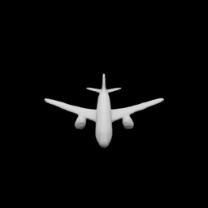
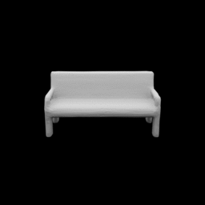
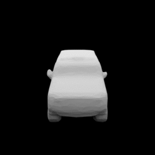
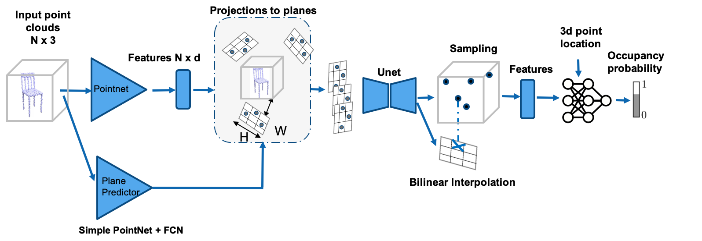

# Dynamic Geo Convolutional Occupancy Network





This repository contains the code for Dynamic Geo Convolutional Occupany Networks as extended work of [Convolutional Occupancy Networks](https://arxiv.org/abs/2003.04618).

You can find detailed usage instructions for training your own models and using pretrained models below.

<!-- TABLE OF CONTENTS -->
## Table of Contents
* [Installation](#Installation)
* [Demo](#Demo)
* [Dataset](#Dataset)
* [Files Architecture](#Files-Architecture)
* [Implementation description](#Implementation-description)
* [Training](#Training)
* [Generation](#Generation)
* [Generation with Rotation](#Generation-with-Rotation)
* [Evaluation](#Evaluation)
* [Visualisation of learned planes](#Visualisation-of-learned-planes)
* [Saved models](#Saved-models)
* [Saved meshes of evaluation](#Saved-meshes-of-evaluation)

You may go to spheres readme [Contribution guidelines for this project](/occupancy_networks/Spheres_README.md)
## Installation
First you have to make sure that you have all dependencies in place.
The simplest way to do so, is to use [anaconda](https://www.anaconda.com/). 

You can create an anaconda environment called `mesh_funcspace` using
```
conda env create -f environment.yaml
conda activate mesh_funcspace
```

Next, compile the extension modules.
You can do this via
```
python setup.py build_ext --inplace

```

To compile the dmc extension, you have to have a cuda enabled device set up.
If you experience any errors, you can simply comment out the `dmc_*` dependencies in `setup.py`.
You should then also comment out the `dmc` imports in `im2mesh/config.py`.

### Install Pytorch scatter extension
#### Upgrade Pytorch to 1.4.0
```
conda install pytorch==1.4.0 cudatoolkit=10.0 -c pytorch
```
#### Install Pytorch scatter
```
pip install torch-scatter==latest+cu100 -f https://pytorch-geometric.com/whl/torch-1.4.0.html
```

## Demo


You can now test our code on the provided input images in the `demo` folder.
To this end, simply run
```
python generate.py configs/demo.yaml
```
This script should create a folder `demo/generation` where the output meshes are stored.
The script will copy the inputs into the `demo/generation/inputs` folder and creates the meshes in the `demo/generation/meshes` folder.
Moreover, the script creates a `demo/generation/vis` folder where both inputs and outputs are copied together.

## Dataset

To evaluate a pretrained model or train a new model from scratch, you have to obtain the dataset.
To this end, there are two options:

1. you can download our preprocessed data
2. you can download the ShapeNet dataset and run the preprocessing pipeline yourself

Take in mind that running the preprocessing pipeline yourself requires a substantial amount time and space on your hard drive.
Unless you want to apply our method to a new dataset, we therefore recommmend to use the first option.

### Preprocessed data
You can download our preprocessed data (73.4 GB) using

```
bash scripts/download_data.sh
```

This script should download and unpack the data automatically into the `data/ShapeNet` folder.

### Building the dataset
Alternatively, you can also preprocess the dataset yourself.
To this end, you have to follow the following steps:
* download the [ShapeNet dataset v1](https://www.shapenet.org/) and put into `data/external/ShapeNet`. 
* download the [renderings and voxelizations](http://3d-r2n2.stanford.edu/) from Choy et al. 2016 and unpack them in `data/external/Choy2016` 
* build our modified version of [mesh-fusion](https://github.com/davidstutz/mesh-fusion) by following the instructions in the `external/mesh-fusion` folder

You are now ready to build the dataset:
```
cd scripts
bash dataset_shapenet/build.sh
``` 

This command will build the dataset in `data/ShapeNet.build`.
To install the dataset, run
```
bash dataset_shapenet/install.sh
```

If everything worked out, this will copy the dataset into `data/ShapeNet`.

## Files Architecture
When you have installed all binary dependencies and obtained the preprocessed data, you are ready to run our pretrained models and train new models from scratch.

### Directory layout                  
    ├── src                     # Source files 
    ├── img                     # Images for README 
    └── README.md

### Source files

    ├── ...
    ├── src                 
    │   ├── point_plane_net        # main code for dynamic planes
    │   ├── sphere_encodings       # code for sphere encodings
    │   ├── rotation_generation    # code for gen with rotation
    │   ├── triplet_loss_planes    # code for triplet loss
        ├── visualisation_planes   # code for learned planes visualisation
        ├── experiments            # code for Point-Plane-Net implementation, 
                                   #      rotations experiments
    │ 
    └── ...

## Implementation description
We have implemented:
* Encoder
  * Planes Encoder
  * Sphere Encoder
* Decoder
  * Planes Decoder
  * Sphere Decoder
* Visualisation of planes
* Meshes generation of Rotated objects
* Triplet Loss
* Plane-Height-Map


| Branch name/Contents | Encoder                                                                                                                                                            | Decoder                                                                                                                                                                               | Rotation               |
|----------------------|--------------------------------------------------------------------------------------------------------------------------------------------------------------------|---------------------------------------------------------------------------------------------------------------------------------------------------------------------------------------|------------------------|
| master branch        | `im2mesh/encoder/fc_point_net.py` <br /> `im2mesh/encoder/__init__.py`<br /> `conv_onet/im2mesh/encoder/pointnet.py`<br /> `conv_onet/im2mesh/encoder/__init__.py` | `im2mesh/onet/models/decoder.py`<br /> `im2mesh/onet/models/__init__.py` <br />  `conv_onet/im2mesh/onet/models/decoder.py `<br /> `conv_onet/im2mesh/onet/models/__init__.py` <br /> |                          |
| sphere branch        | `im2mesh/encoder/fc_point_net.py`   <br /> `im2mesh/encoder/__init__.py` <br /> `im2mesh/encoder/additional_encoders.py`                                           | `im2mesh/onet/models/decoder.py` <br /> `im2mesh/onet/models/__init__.py` <br />                                                                                                      |                        |
|fc_plane_prediction   |                                                                                                                      |                        |   `generate_rotation.py` <br/> `eval_meshes.py` <br/> `im2mesh/onet/generation.py` <br/>  `im2mesh/onet/training.py` <br/> `train_point_plane_rotate.py` |

| Branch name/Contents | Triplet Loss                                                                                                                                       | Visualisation                                        |
|----------------------|----------------------------------------------------------------------------------------------------------------------------------------------------|------------------------------------------------------|
| triplet loss         | `im2mesh/onet/models/__init__.py`<br /> `im2mesh/onet/config.py` <br /> `im2mesh/onet/training.py` <br /> `im2mesh/encoder/additional_encoders.py` |                     -                                 |
| visualisation planes |                                                                                                                                                  -  | `normal_per_class.py` <br /> `generate_plane_vis.py` |                                                            
                                                          


To run the code of one of implemented regimes go to corresponding branch folder and follow their README

## Training

In all config files specify in ``data/path`` the actual path to your Shapenet dataset.

### **Training Point Plane Net**
Follow this [Readme](/src/point_plane_net/point_plane_README.md)


### **Training Dynamic Plane + Height Map Convolutional Occupancy Network**
Follow this [Readme](/src/point_plane_net/point_plane_README.md)


### **Training Dynamic Plane + Spheres Convolutional Occupancy Network**
Follow this [Readme](/src/sphere_encodings/spheres_README.md)

### **Training Dynamic Plane Convolutional Occupancy Network With Triplet Loss**
Follow this [Readme](/src/triplet_loss_planes/Triplet_README.md)

You should specify ``margin_triplet`` in ``training`` part. Choose ``triplet_fc_plane_net`` as class model in ``encoder``, ``cbatchnorm`` in ``decoder``


## Generation
To generate meshes using a trained model, use
```
python generate.py CONFIG.yaml
```
where you replace `CONFIG.yaml` with the correct config file.

The easiest way is to use a pretrained model.
You can do this by using one of the config files
```
configs/img/onet_pretrained.yaml
configs/pointcloud/onet_pretrained.yaml
configs/voxels/onet_pretrained.yaml
configs/unconditional/onet_cars_pretrained.yaml
configs/unconditional/onet_airplanes_pretrained.yaml
configs/unconditional/onet_sofas_pretrained.yaml
configs/unconditional/onet_chairs_pretrained.yaml
```
which correspond to the experiments presented in the paper.
Our script will automatically download the model checkpoints and run the generation.
You can find the outputs in the `out/*/*/pretrained` folders.

Please note that the config files  `*_pretrained.yaml` are only for generation, not for training new models: when these configs are used for training, the model will be trained from scratch, but during inference our code will still use the pretrained model.

## Generation with Rotation
Follow this [Readme](/src/rotation_generation/README_generation_and_eval_meshes.md)

## Evaluation
For evaluation of the models, we provide two scripts: `eval.py` and `eval_meshes.py`.

The main evaluation script is `eval_meshes.py`.
You can run it using
```
python eval_meshes.py CONFIG.yaml
```
The script takes the meshes generated in the previous step and evaluates them using a standardized protocol.
The output will be written to `.pkl`/`.csv` files in the corresponding generation folder which can be processed using [pandas](https://pandas.pydata.org/).

For a quick evaluation, you can also run
```
python eval.py CONFIG.yaml
```
This script will run a fast method specific evaluation to obtain some basic quantities that can be easily computed without extracting the meshes.
This evaluation will also be conducted automatically on the validation set during training.

All results reported in the paper were obtained using the `eval_meshes.py` script.


## Visualisation of learned planes
Follow this [Readme](/src/visualisation_planes/visualisation_README.md)

## Saved models
You can find saved weights of our models following this [link](https://drive.google.com/drive/u/0/folders/1FXpapUhfDlqRm1XPnJ0rP9349OoRTUrD)


## Saved meshes of evaluation
 You can find quantitative results of meshes at evaluation of our models following this [link](https://drive.google.com/drive/folders/1UFui7e5KrzTrbjY_hQmHDFGgWHN7xNqT)


# Futher Information
Please also check out the following concurrent papers that have proposed similar ideas:
* 
* [Songyou Peng et al. - Convolutional Occupancy Networks (2020)](https://arxiv.org/abs/2003.04618)
* [Chen et al. - Learning Implicit Fields for Generative Shape Modeling (2019)](https://arxiv.org/abs/1812.02822)
* [Michalkiewicz et al. - Deep Level Sets: Implicit Surface Representations for 3D Shape Inference (2019)](https://arxiv.org/abs/1901.06802)
