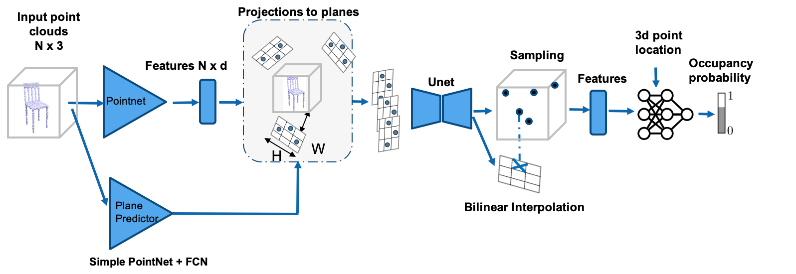
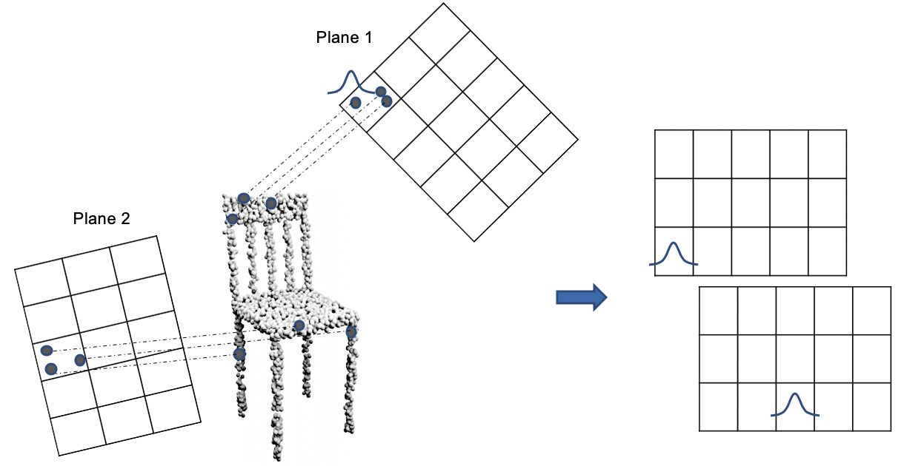

# Training Point Plane Net


Run:
```
python train_point_plane.py point_plane_net.yaml model_name
```

You may use either ``src/point_plane_net/conv_onet/exp_configs/pointcloud/shapenet_dynamicV2_3plane.yaml`` or ``src/point_plane_net/configs/pointcloud/dpoc.yaml``. Specify the number of learned planes by changing parameter ``n_channels`` in ``encoder_kwargs``


# Training Dynamic Plane + Height Map Convolutional Occupancy Network


```
python train_point_plane.py height_planes.yaml model_name
```

Use ``fc_height_plane_net`` as the model class in ``encoder``. You may change number of planes with height maps by changing the argument ``n_channels`` in ``encoder_kwargs``