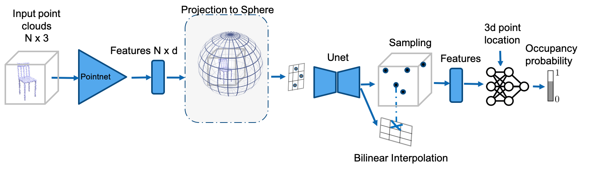

# Dynamic Plane + Spheres Convolutional Occupancy Network



## Table of Contents
* [Sphere Encoding](#Sphere-Encoding)
* [Sphere Radius-Map Encoding](#Sphere-Radius-Map-Encoding)
* [Sphere Voxel Encoding](#Sphere-Voxel-Encoding)
* [Multi-Learning Spheres Encoding](#Multi-Learning-Spheres-Encoding)
* [Multi-Const Spheres Encoding](#Multi-Const-Spheres-Encoding)
* [Point_Plane_Sphere_Height_map Encoding](#Point_Plane_Sphere_Height_map-Encoding)

## **Sphere Encoding**
<!--  -->
Sphere |   Sphere Discretisation   | 
:-------------------------:|:-------------------------:|
 |   |  

```
python train_point_plane.py sphere.yaml model_name
```
Use`` sphere_net`` in ``encoder`` and ``sphere`` in`` decoder``. Put ``one_sphere`` in ``interpolation`` in the ``decoder_kwargs``.
You may change the discretisation of sphere (number of meridians/latitudes) by changing the parameter of `latitudes/meridians` in `encoder_kwargs` and `decoder_kwargs`

## **Sphere Radius-Map Encoding**


```
python train_point_plane.py sphere_height.yaml model_name
```

Use`` sphere_height_net`` in ``encoder`` and ``sphere`` in`` decoder``. Put ``one_sphere`` in ``interpolation`` in the ``decoder_kwargs``.
You may change the discretisation of sphere (number of meridians/latitudes) by changing the parameter of `latitudes/meridians` in `encoder_kwargs` and `decoder_kwargs`


## **Sphere Voxel Encoding**


```
python train_point_plane.py multi_voxel.yaml model_name
```

Use`` multi_voxels_sphere`` in ``encoder`` and ``sphere`` in`` decoder``. Put ``multi_voxel_sphere`` in ``interpolation`` in the ``decoder_kwargs``. You may change the number of "depth-layers" (in the radious dimension) by changing the parameter of `rad_dim` in `encoder_kwargs` and `decoder_kwargs`

## **Multi-Learning Spheres Encoding**


```
python train_point_plane.py multi_sphere.yaml model_name
```

Use`` multi_sphere_net`` in ``encoder`` and ``sphere`` in`` decoder``. Put ``multi_spheres`` in ``interpolation`` in the ``decoder_kwargs``. You may change the number of learned spheres  by changing the parameter of `n_channels` in `encoder_kwargs`

## **Multi-Const Spheres Encoding**


```
python train_point_plane.py multi_const_spheres.yaml model_name
```

Use`` const_multi_spheres`` in ``encoder`` and ``sphere`` in`` decoder``. Put ``multi_spheres`` in ``interpolation`` in the ``decoder_kwargs``. You may change the number of constant-positioned spheres  by changing the parameter of `n_channels` in `encoder_kwargs` and then change the position of spheres-centers manually in the class const_multi_spheres

## **Point_Plane_Sphere_Height_map Encoding**

```
python train_point_plane.py sphere_plane_height.yaml model_name
```
Use`` sphere_height_plane_net`` in ``encoder`` and ``cbatchnorm`` in`` decoder``.  You may change the number of learned planes  by changing the parameter of `n_channels` in `encoder_kwargs` and then change the position of spheres-centers manually in the class const_multi_spheres

